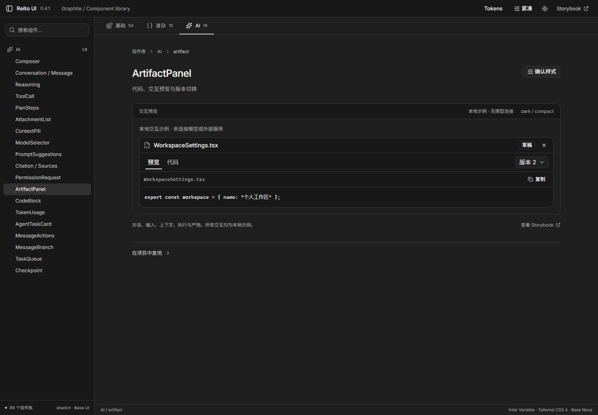

# 0.4 内容密度调整

表格和 AI 面板现在随全局密度一起调整内容间距。0.3 主要改变按钮与输入控件高度，DataTable 仍固定使用 12px 四周内距，AI 权限和产物内容仍固定为 16px。0.4 将这些尺寸放入同一份 tokens.json，组件不再各自决定这组间距。

## 实际变化

在 1440×1000、暗色、紧凑模式和相同示例内容下测量：

| 项目 | 调整前 | 0.4 紧凑 | 0.4 舒适 |
| --- | ---: | ---: | ---: |
| 表格单元格上下 / 左右内距 | 12 / 12px | 6 / 10px | 10 / 16px |
| DataTable 示例数据行高度 | 46px | 34px | 42px |
| AI 产物预览、权限与任务卡内容内距 | 16px | 12px | 20px |
| Composer 输入文字内距，上下 / 左右 | 固定间距 | 8 / 12px | 12 / 20px |
| Composer 输入区最小高度 | 112px | 80px | 112px |
| Lab 组件预览外围内距 | 32px | 16px | 24px |

行高是当前单行示例的浏览器实测值；长文本、额外操作或换行仍会自然增加行高。没有使用固定高度裁剪内容。输入正文仍为 16px，表格仍为 14px。

产物的代码 tab 不再为 CodeBlock 再套一层 padding。`CodeBlock variant="embedded"` 由已有容器提供边界，代码本身只保留一次内容内距；默认 `variant="default"` 仍可独立使用。




## 共享角色

数值均从 [tokens.json](../packages/tokens/src/tokens.json) 生成，下面按根字号 16px 折算。

| Token 后缀（统一前缀 `--rui-`） | 紧凑 | 舒适 | 用途 |
| --- | ---: | ---: | --- |
| `content-padding` | 12px | 20px | AI 内容、设置和面板内容 |
| `content-gap` | 12px | 16px | 内容组间距 |
| `content-gap-sm` | 8px | 12px | 组内辅助内容 |
| `cell-padding-x` | 10px | 16px | 表格、列表与短工具栏水平内距 |
| `cell-padding-y` | 6px | 10px | 表格与列表垂直内距 |
| `table-head-padding-y` | 4px | 6px | 表格表头垂直内距 |
| `table-head-height` | 36px | 48px | 表头最小尺寸 |
| `message-gap` | 16px | 24px | 会话消息之间 |
| `composer-input-height` | 80px | 112px | 可继续拉高的消息输入区 |
| `empty-padding` | 24px | 40px | 空态与加载内容 |
| `preview-padding` | 16px | 24px | Lab 演示宿主外围 |

```tsx
// 两档密度由根统一切换，弹层也继承。
document.documentElement.dataset.density = 'compact';

// 新组合使用已有角色，不单独复制数值。
<section className="grid gap-[var(--rui-content-gap)] p-[var(--rui-content-padding)]">
  {children}
</section>
```

这是有意改变的默认外观。升级时同时安装 0.4.1 的 UI 和 tokens 包，并检查消费应用是否还为 Table、Artifact 或 CodeBlock 额外增加了内距。不要通过页面内部选择器抵消共享密度。

## 验证与视觉边界

[密度回归测试](../tests/density.spec.ts) 已在 dark/light × compact/comfortable 四组合检查基础 Table、DataTable、Artifact 两个视图、PermissionRequest 和 Composer。它还验证发送仍可用、输入字号不变以及代码 tab 外层 padding 为零。[最终浏览器度量](../.logs/density-final-v04.json) 包含 16 份尺寸与截图记录。[调整前度量](../.logs/v04-density-before.json) 保留原始比较。

实际查看了紧凑暗色表格、产物代码和输入区，以及舒适浅色表格。对照的是已保存并打开的 [Cursor Agents Window 官方工作面](https://cursor.com/docs/agent/agents-window) 图像（来源详见 [references.md](references.md)）：短工具栏、行式信息与连续工作面是参考重点。该参考含命令弹层和背景遮罩，不能用来确认日常暗色的精确颜色，也没有用于测量官方 padding。Graphite 的尺寸是原创选择；Lab 仍保留组件目录、说明和确认区，与真正的会话或编辑工作面不同。构建、交互与 axe 检查证明可运行性，不证明产品外观相同。
