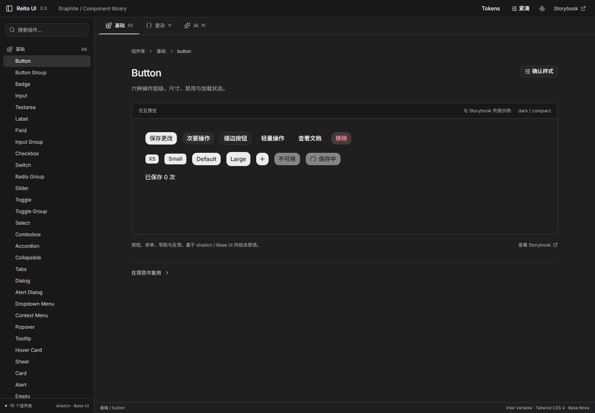
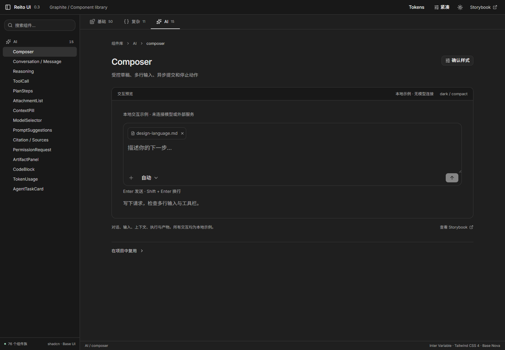
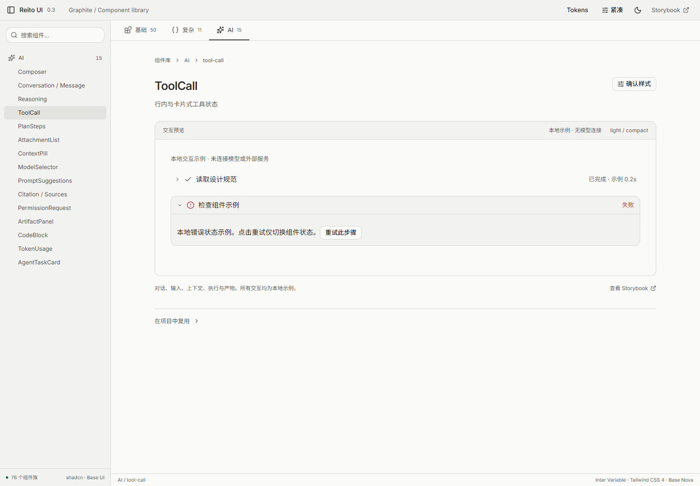

# 0.3.0 验证记录

2026-09-06，Windows / Microsoft Edge，Node 24.11.1。本记录针对 shadcn / Base UI / Tailwind 重建后的最终实现；0.2 的旧报告留在 `.logs/legacy-v0.2/validation.md`。

## 最终结果

| 检查 | 实际结果 | 范围与证据 |
| --- | --- | --- |
| `npm run check` | 通过 | tokens 同步；3 份 CSS 变量；28 个业务源文件语义色；基础依赖方向；46 对颜色对比；UI / Lab / Storybook 类型 |
| `npm run build` | 通过 | 组件包 ESM + 声明、Lab、静态 Storybook；最后 Lab 目录切换变更另跑 build 通过 |
| `npm run test:ui` | 12/12 通过 | 三层目录 50/11/15、搜索/深链、主题/密度持久化、确认备注、render 组合密度、portal 键盘与 axe、四种视口 |
| `npm run test:storybook` | 608/608 通过 | 76 组件族、152 stories、24 个 play，各 dark/light × compact/comfortable；0 page/console error、0 axe 违规、0 页面横向溢出 |
| 独立 tarball 类型与构建 | 通过 | React 19 + Vite 8；严格 Bundler / NodeNext，skipLibCheck=false；不安装 Tailwind 插件或 shadcn CLI |
| 独立 tarball 交互 | 四组合通过 | Select、Dialog、Composer；实际字体加载、16px 图标、普通及 render 合成按钮密度；无 console/page error |
| 三宿主样式 | 四组合一致 | Lab / Storybook / tarball 的 default Button 字体、字号、字重、行高、高度、圆角、文字色、背景色；不比较不同内容导致的宽度 |
| 目录深链 | 76/76 存在 | Lab 到实际 Storybook story ID 的对应关系 |
| Skill | 通过 | quick_validate.py 校验；仓库与个人安装目录两份文件 SHA256 一致 |
| Tokens 导出 | 通过 | 浏览器实际下载 JSON，包含 foundation 与 themes |

完整机器证据：[Storybook](../../.logs/storybook-audit.json)、[三宿主度量](../../.logs/host-contract-v03.json)、[最终消费工程](../../.logs/consumer-v03/final-consumer-verification.json)、[深链](../../.logs/storybook-links.json)。Storybook 扫描期间源码指纹一致，无禁用 axe 规则。24 个 play 的四组合已包含在 608 计数中，不能重复相加。

## 在验证中修复的问题

- 上游 Combobox 清除操作的名称、Slider 标签和 thumb 索引、Calendar 的焦点 ref；两处基础文字对比度。
- CommandSearch 空/加载提示从结果列表分离，按实际结果维护 aria-expanded；不以虚假可选项凑 ARIA 子元素。
- FileUpload 禁用说明继续可读；alert 包含正常 ul/li，而非覆盖列表语义。
- WorkspacePane 的滚动区可以键盘聚焦并滚动。
- Button 增加稳定 `data-rui-button`。Base UI render 会改写 data-slot，因此密度不能依赖 `[data-slot=button]`。独立包确认普通、触发器、关闭按钮高度一致。
- Storybook 扫描同时收集 console.error。仅检查 `currentRender.phase=finished` 会漏掉部分 play 断言错误；已修复 Checkbox 的 ARIA 禁用断言与 Dialog 的异步可见性等待。

## 安装与包证据

最终 UI tarball SHA256：`0d12674985b96900316b7ab8c94d54fc4ad511e387a0aa2fe89d4f10d521a0d6`。

Tokens tarball SHA256：`387f6d7c10a0c96ab5868e7a912b7345c4a60acda471ed6fce914f6e31646d86`。

消费验证先安装初版，再用最终包更新。已比对 npm lock integrity、安装 CSS 与 tarball 字节，排除了相同版本号导致的旧缓存；最终报告不是初版报告。两个包仅在本机分发，未发布 npm。

公共 CSS 含字体、Tailwind Preflight 和已编译 utilities。构建仍提示 Lab 整库演示与部分 Storybook chunk 超过 500 kB；这是演示宿主的体积提示，构建退出码为0。组件包使用分层 ESM 入口；没有把 Lab 或 Storybook 的运行时代码纳入公共入口。

## 实际视觉检查

检查了基础按钮、数据表格、Composer、ToolCall 和工作区布局的浏览器渲染；保存了深浅主题和 390px 窄屏。桌面截图 1440×1000；自动布局检查还覆盖 1280×800、960×720、640×400、390×844。截图等待字体与主题过渡完成，避免把主题切换中间帧作为最终结果。

整体沿用已审计参考中的短工具栏、轻导航行、中性灰阶、连续内容与组合输入区。现在的 Lab 是组件确认工具，其目录与预览结构有自己的用途；不会据此声称它是 Cursor 或 Claude Desktop 的像素复刻。参考证据继续见 [来源与审计](../references.md)。

## 保留的验收边界

- 自动 axe 与合成键盘事件不替代屏幕阅读器、真实 Windows 中文输入法、真实浏览器200%缩放和跨浏览器验收。640px 视口只证明该布局宽度可用。
- AI、上传、权限等例子演示本地组件状态；模型调用、后端执行、权限策略、上传协议与持久化由消费工程提供。
- DataTable 目前是客户端表格，不含虚拟化或服务端协议；DisclosureTree 是可访问的折叠目录，不承诺 ARIA TreeView 全套键盘模型。完整国际化和代码语法高亮未在该版本实现。
- 76 个组件族具有可发现的组合与适用状态示例，不代表每一种 props 笛卡尔积都已覆盖。实际产品仍需检查自己的组合流程。
