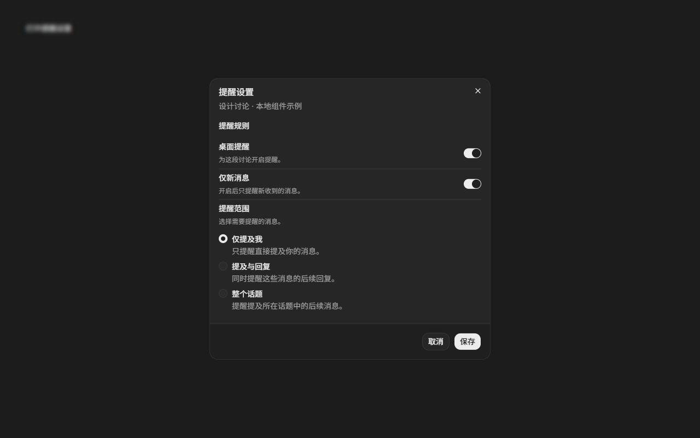
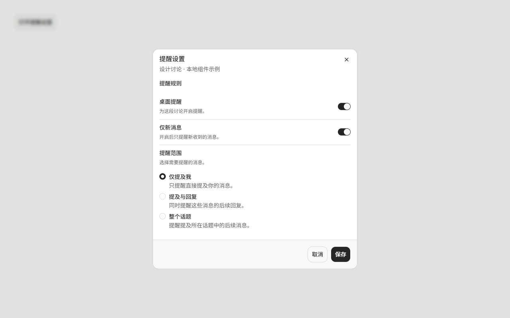

# 设置组合验证

日期：2026-09-21。新增 API 以 0.5.1 源码为基线，不修改版本或发布包。

## 已执行

- `npm run check`：token 同步、catalog、设计审计、token 审计和各工作区 typecheck 通过。
- `npm run build`：UI、Lab、Storybook、Workbench 构建通过。现有大 chunk 提示仍保留。
- 独立 Storybook 的真实浏览器交互：标签切换 Switch，依赖项禁用，单选标签选择与方向键，取消丢弃草稿，保存后重新打开读回，Escape/取消后恢复触发器焦点。
- DOM 检查：无重复 ID，aria-labelledby / aria-describedby 均指向存在的节点；RadioGroup 与各选项的可访问名称独立。
- 加载状态没有可误读为默认值的控件，保存禁用；失败状态显示提示，重试恢复可编辑状态。
- dark/light × compact/comfortable 的弹窗均通过 axe-core WCAG 2 A/AA、2.1 AA 检查，违规数为 0。扫描范围为打开的 dialog，未关闭任何规则。

| 主题 | 密度 | 视口 | 弹窗宽 × 高 | 横向溢出 |
| --- | --- | --- | --- | --- |
| dark | compact | 1280 × 800 | 512 × 512.25 | 无 |
| dark | comfortable | 1280 × 800 | 512 × 552.25 | 无 |
| light | compact | 1280 × 800 | 512 × 512.25 | 无 |
| light | comfortable | 1280 × 800 | 512 × 552.25 | 无 |

960 × 720、390 × 700、640 × 400 视口的弹窗保持在视口内，无横向溢出。640 × 400 时弹窗高度限制为 368，通过内部滚动仍可保存。640 × 400 是小视口布局检查，不等同于真实浏览器 200% 缩放；实际缩放和屏幕阅读器未执行。

## 视觉参考

已查看仓库自己的 [Workbench 设置参考](images/v04-workbench-settings-dark.png)，对照安静的灰阶、行分隔、标签/说明层级和控件对齐。新增 plain 变体用于弹窗内部，因此有意去掉参考页的分组外框；完整页面侧栏不属于此组合。密度只改变空间与控件高度，未另设字体或颜色。

截图全部为公开组件的虚构本地示例。

## 环境与边界

新工作区首次 `npm ci` 遇到基线 lockfile 缺少 `@emnapi/core` / `@emnapi/runtime` 条目；使用 `npm install --package-lock=false --no-audit --no-fund` 安装依赖，未修改 lockfile。首次 typecheck 在 UI 声明尚未生成时失败，先构建 UI 后完整 check 通过。

浏览器验证通过 CUA 在独立本地 Storybook 运行，没有运行全仓 Playwright suite。自动无障碍检查不等同于完整无障碍认证。示例没有持久化、消息收发或后台业务行为。
