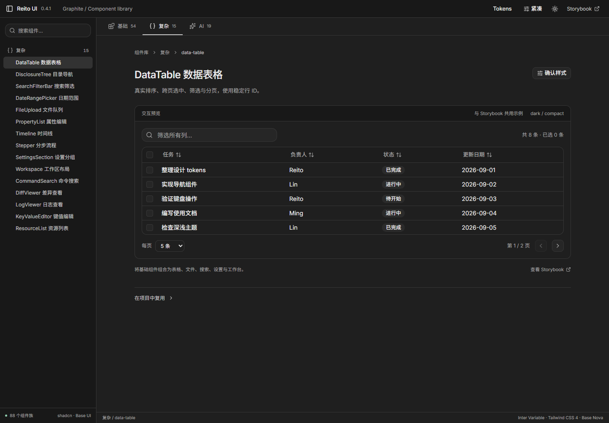
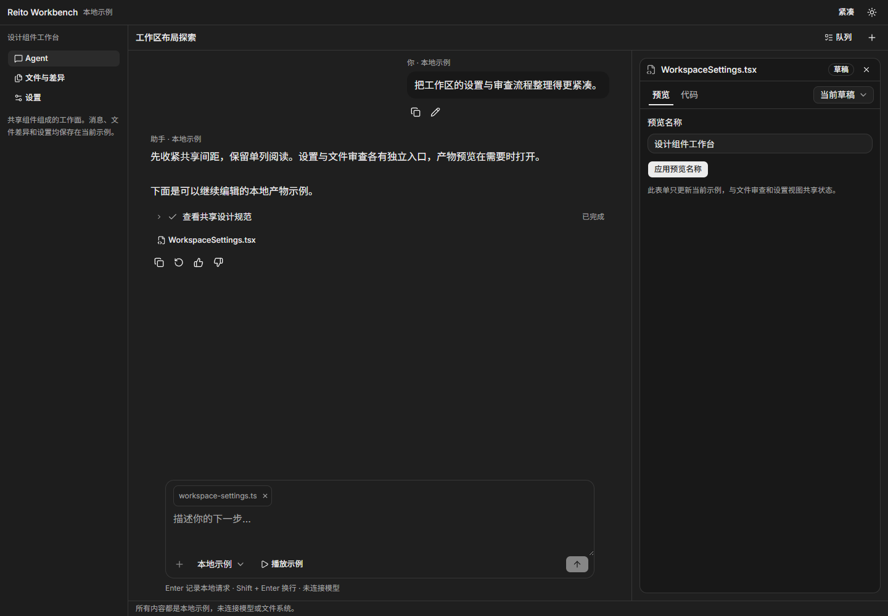

# 0.4.1 验证记录

最新工作区增量：[DiffViewer 行高](validation-diff-density.md)、[Storybook 实时参数调试](validation-storybook-controls.md)、[Storybook 独立变体](validation-storybook-variants.md)、[全组件 Token 审计与验证](validation-token-audit.md)。

后续工作区修正：[ContextPill 等高验证](validation-context-pill.md)、[消息字号验证](validation-message-typography.md)、[CodeBlock 语法高亮验证](validation-code-highlight.md)、[TaskQueue 单行布局验证](validation-task-queue.md)、[Workspace 目录密度验证](validation-workspace-density.md)。下列发布候选记录与 0.4.1 tarball 证据保留原样；后续源码修正未覆盖已有 tarball。

2026-09-06，Windows / Microsoft Edge，Node 24.11.1。0.4 扩展三层组件并统一内容密度；0.4.1 修复 Composer 停止时意外提交草稿的问题。0.3 记录保留在 [历史报告](history/validation-v03.md)，0.4.0 候选包与原始消费报告也保留。

## 最终结果

| 检查 | 实际结果 | 范围与证据 |
| --- | --- | --- |
| `npm run check` | 通过 | tokens 与 catalog 同步；4 份 CSS、44 个业务源文件语义色；基础依赖方向；46 对颜色对比；UI / Lab / Storybook / Workbench 类型 |
| `npm run build` | 通过 | UI 分层 ESM 与声明、Lab、静态 Storybook、Workbench 生产构建 |
| `npm run test:ui` | 30/30 通过 | Lab 12 项、内容密度 4 项、Workbench 14 项；主题/密度、搜索深链、对话框焦点、共享按钮、队列、审查、设置、停止保留草稿、窄屏 |
| `npm run test:storybook` | 856/856 通过 | 88 组件族、214 stories、44 个 play；dark/light × compact/comfortable；当前 story 完成状态无 page/console error、axe 违规或页面横向溢出 |
| 独立 tarball 类型与构建 | 通过 | 真实安装 0.4.1；严格 Bundler / NodeNext、skipLibCheck=false；React 19 + Vite，无 Tailwind 插件或 shadcn CLI |
| 独立 tarball 交互与密度 | 四组合通过 | Button、Select、Dialog、Toast、NumberField、MultiSelect、Table/DataTable、Artifact、Composer；停止后草稿保留且未提交 |
| 独立 tarball 打开弹层的 axe | **有未通过项** | 四组合的 MultiSelect 打开状态均报告 `aria-hidden-focus`，每组合 11 个背景节点；其他已扫描状态无违规。未禁用规则、未过滤节点 |
| 三宿主样式 | 12 组比较通过 | Lab / Storybook / tarball：4 组 default Button，4 组 DataTable cell，4 组 Artifact 嵌入代码；字体与相应尺寸一致 |
| 目录深链与 Tokens 下载 | 通过 | 88/88 链接指向实际 story；浏览器下载的 JSON 包含新 density 角色 |
| Skill 与文档 | 通过 | 仓库和个人 Skill 校验成功且两份文件 SHA 相同；11 个密度角色匹配 token 源；文档公共 API 示例类型检查通过 |

证据：[check](../.logs/check-v041.log)、[build](../.logs/build-v041.log)、[页面测试](../.logs/ui-tests-v041.log)、[Storybook 最终报告](../.logs/storybook-audit-v041.json)、[消费验证](../.logs/consumer-v04/consumer-verification.json)、[三宿主度量](../.logs/host-contract-v041.json)、[目录链接](../.logs/storybook-links-v04.json)。最终 Storybook 扫描的前后源码指纹相同，没有在扫描中修改组件或关闭 axe 规则。

**Storybook 结果只说明这些 story 结束时的组合。** 它不能代替独立消费页的打开状态扫描，更不能覆盖后者的未通过项。44 个 play 的四组合已包含在 856 中，不重复相加。

## 密度与实际视觉

同一份暗色紧凑示例中，DataTable 单元格由四周 12px 改为上下 6px、左右 10px，数据行从 46px 降为 34px。AI 产物与权限内容区从 16px 改为 12px；舒适模式为 20px。Composer 输入区最小高度为 80/112px，输入正文保持 16px。Artifact 代码 tab 外层内距为零，CodeBlock 只保留一次内容内距。

改动来自 tokens、共享组件与演示宿主的密度角色；没有在 Lab 为单个表格或 AI 面板添加内部选择器覆盖。数值、前后测量、图片与升级说明见 [内容密度调整](density-v04.md) 和 [最终度量](../.logs/density-final-v04.json)。

实际查看了暗色紧凑的表格、代码产物、Composer、工作台会话与审查，及浅色舒适表格、浅色紧凑审查；截图等待字体和有限动画结束。对照了已保存并打开的 Cursor Agents Window 官方截图，来源见 [references.md](references.md)。参考打开了命令弹层并带背景遮罩，不能用于确认日常暗色的精确色值。

工作台采用短工具栏、轻量导航、连续正文、底部 composer 与按需产物面板；文件审查和设置保持工作所需结构。Lab 则保留组件目录、说明与确认区。字体、灰阶、圆角、尺寸由本库定义；示例没有产品真实编辑器、扩展或执行系统，不能把通过测试或采用相似结构称作像素复刻。

## 组合中发现的事项

- **Composer 停止误提交已修复。** 宿主同步设置 `running=false` 时，React 可能复用原停止按钮并使其成为 submit。共享停止处理现在先阻止默认行为，再调用 `onStop`。新增受控草稿 story、Workbench 与最终安装包均验证未意外提交。
- **NumberField 边界状态已修复。** 达到 min/max 只禁用相应步进按钮，仍可编辑的输入保持正常对比度。
- **MultiSelect 的扫描提示保留。** Tab、Escape、背景点击与后续字段可达性通过；上游采用 DOM 焦点不锁定、读屏虚拟光标限制在选项范围的策略。这不证明真实读屏体验已通过，也不能抹掉扫描提示。正式组件保留 inline Chips + Input；未为通过扫描强改交互、修改上游私有代码或注入页面补丁。原始节点、源码、官方说明与验收边界见 [专门记录](a11y-combobox-note.md)。

## 包与复用证据

最终使用 `artifacts/reito-ui-0.4.1.tgz` 与 `artifacts/reito-tokens-0.4.1.tgz`，没有发布 npm。

| 包 | SHA256 |
| --- | --- |
| UI | `dabc196895048583d4c76d675f56b4966a8b1b782e38ad342ef182280c8dcebd` |
| Tokens | `00bb907e67ba6b74cf494baccd8840361e6507df501a92f06a9b38414ca6f658` |

消费工程安装目录为实体而非 workspace symlink；lock integrity 与 tarball 匹配，安装 CSS 与打包 CSS 的字节哈希相同。[安装核验](../.logs/consumer-v04/install-verification.json) 和 [包哈希](../.logs/artifacts-v041.json) 保留证据。消费页独立使用已编译组件 CSS，不借助仓库 Tailwind 编译维持外观。

Lab 整库演示、部分 Storybook chunk 和聚合消费页仍有超过 500kB 的 chunk 提示，构建退出码为 0。组件提供分层 ESM 入口；公共 CSS 包含字体、Preflight 与已编译 utilities。

## 保留的验收边界

- 页面测试包含 390/640/960/1280px 与工作台 200% 根字号重排。200% 根字号不是浏览器真实 200% 缩放；合成 composition 事件也不是 Windows 真实中文输入法验收。跨浏览器、屏幕阅读器与触屏读屏仍需实际设备测试。
- MultiSelect 打开状态的 `aria-hidden-focus` 未消除，不能报告全库“所有无障碍检查通过”。其他组合仍需消费产品自己验收。
- AI、权限、队列、恢复、文件与上传示例均是本地状态；组件不提供模型、后端执行、磁盘访问、上传协议或权限策略。
- DataTable 是客户端表格，未提供虚拟化与服务端协议；DiffViewer 消费明确行配对，不计算 diff；LogViewer 不连接日志或执行终端。完整国际化和语法高亮未在此版本实现。
